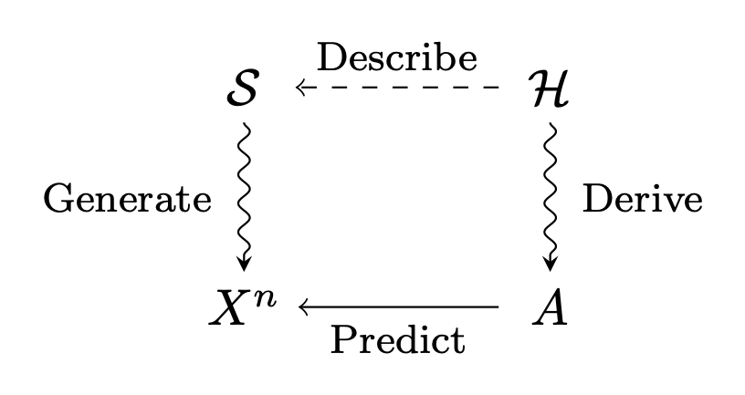

---
# Feel free to add content and custom Front Matter to this file.
# To modify the layout, see https://jekyllrb.com/docs/themes/#overriding-theme-defaults

layout: home
---
<!--  -->

## Bio

* Apr 2019~, Researcher, IBM Research - Tokyo
* ~Mar 2019, Ph.D. (Information Science and Engineering), the University of Tokyo
* ~Mar 2016, Master of Science (Engineering), the University of Tokyo
* ~Mar 2014, Bachelor of Science (Engineering), the University of Tokyo

## Research Interests

* Online Learning
* Reinforcement Learning
* Information Theory
* Statistical Machine Learning

## Contact

E-mail: miyaguchi[at]ibm.com / koheimiyaguchi[at]gmail.com
